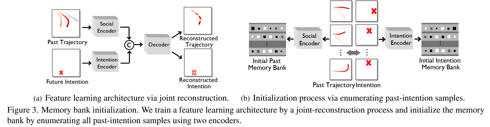
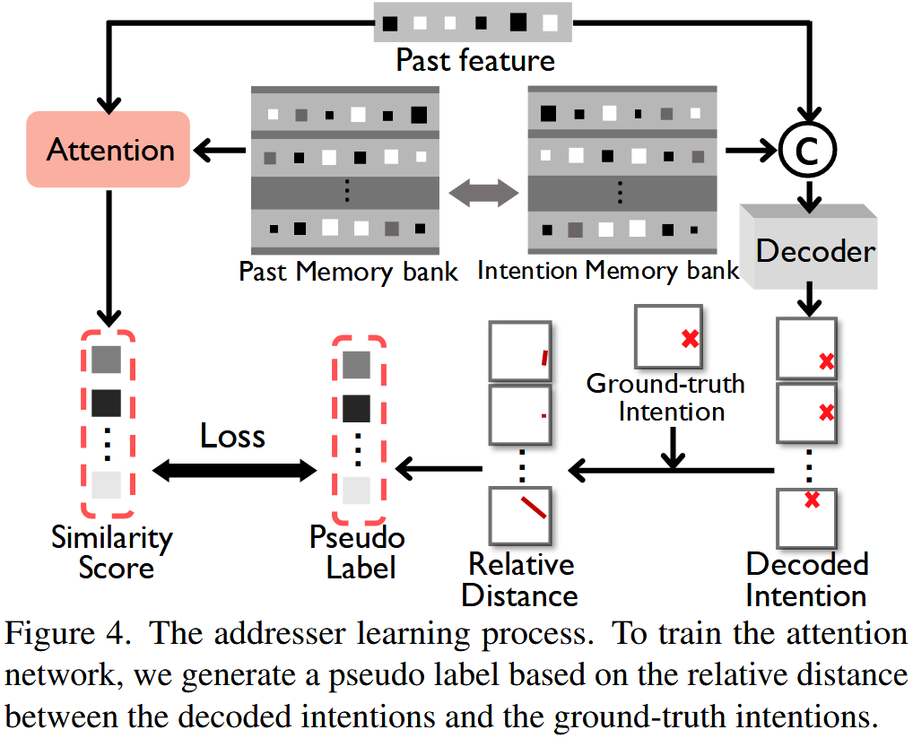
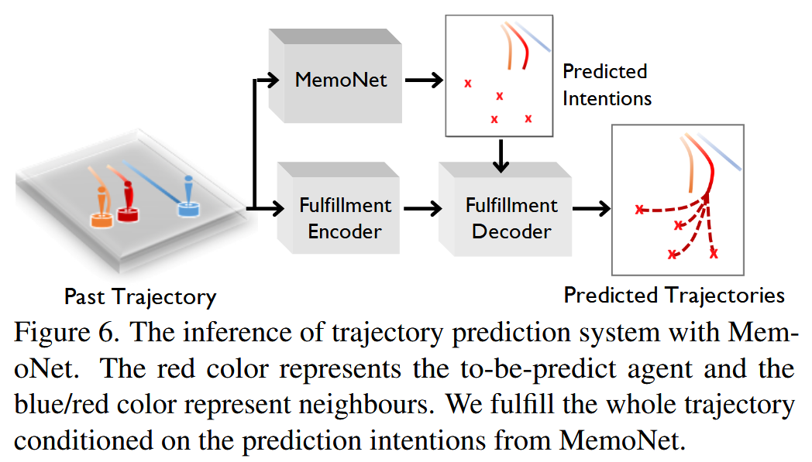
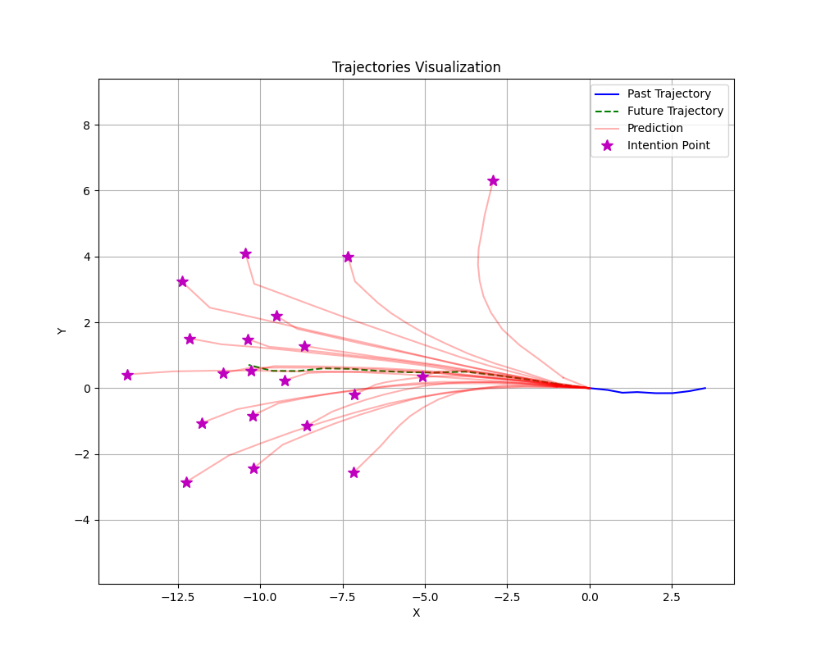

# MemoNet
# 1 说明

本代码程序源自于[开源代码MemoNet](https://github.com/MediaBrain-SJTU/MemoNet/tree/main/ETH)，但面向OnSite学习中心进行了代码格式和结构的调整。


# 2 论文概述

## 2.1 原文链接
https://arxiv.org/pdf/2203.11474

## 2.2 现状与不足

为了实现轨迹预测，大多数以往的方法采用基于参数_（parameter-based）_的方法，将所有已观察到的过去和未来的实例对编码进模型参数中。然而，以这种方式，模型参数源自所有已见实例，这意味着大量无关的已见实例也可能参与当前情境的预测，进而影响性能表现。

## 2.3 所提方法

为了在当前情境和已见实例之间提供更加明确的关联，我们借鉴神经心理学中的回顾性记忆机制_（mechanism of retrospective memory in neuropsychology）_，**提出了MemoNet，一种基于实例**_**（instance-based）**_**的方法，通过寻找训练数据中相似的场景来预测智能体的运动意图。**

在MemoNet中，我们设计了一对显式存储训练集中代表性实例的记忆库，模拟神经系统中的前额叶皮层；

同时设计了一个可训练的记忆寻址器_（memory addresser）_，能够自适应地在记忆库中搜索与当前情境相似的实例，模拟基底神经节的功能。

在预测过程中，MemoNet通过使用记忆寻址器索引记忆库中的相关实例，回忆先前的记忆。

我们进一步提出了一个两步轨迹预测系统，第一步利用MemoNet预测目标位置，第二步根据预测的目标位置完成整个轨迹。

## 2.4 方法效果

实验结果显示，所提出的MemoNet在SDD/ETH-UCY/NBA数据集上，分别将FDE提升了20.3%/10.2%/28.3%，相较于之前的最佳方法。此外，实验还表明，MemoNet在预测过程中能够追溯到特定实例，从而提高了模型的可解释性。

  
# 3 文件压缩包链接


```Bash
# 下载代码文件(MemoNet_ETH.tar)文件至本地后：
tar -xvf MemoNet_ETH.tar #解压
cd ./MemoNet_ETH
```

## 3.1 数据集和预训练权重

数据集和预训练权重下载链接：https://drive.google.com/drive/folders/1qx5vbNgyM9aMH9jB_F07w3QIxzzi6StW

数据集下载至：`MemoNet/data/datasets`

预训练权重下载至：`MemoNet/data/pretrain`

  
# 4 环境配置

```Bash
pip install torch==1.8.1+cu111 torchvision==0.9.1+cu111 torchaudio==0.8.1 -f https://download.pytorch.org/whl/torch_stable.html
pip install easydict==1.13 glob2==0.7 opencv-python==4.10.0.84 pillow==10.4.0 PyYAML==6.0.2 typing_extensions==4.12.2 tqdm==4.66.5 matplotlib==3.7.0 numpy==1.23.0
```

  

# 5 快速开始

> _采用官方提供的预训练权重执行测试或可视化代码，验证环境配置是否成功_

```Bash
bash start.sh
```

```
Processing Batches: 100%|█████████████████████| 1143/1143 [03:59<00:00, 4.78it/s]

------ Test FDE_48s: 0.6311913728713989 ------ Test ADE: 0.40732327103614807
```


# 6 训练指令

> _训练过程分为四个阶段，对应config中__`intention`__,__`addressor_warm`__,__`addressor`__,__`trajectory`__四个mode，具体细节可见论文原文的5.2节 Overall training pipeline_

## 6.1 训练Auto-Encoder与初始化Memory Bank

> 

mode设为`intention`_，_导入预训练model和banks，在results/eth_try3生成了model和banks，命令如下：

```Bash
# Train the intention encoder-decoder
python train.py --gpu 0 --mode intention --model_encdec data/pretrain/eth/model.pt --info exp_intention
```

## 6.2 训练记忆寻址器（粗）

> 

mode设为`addressor_warm`

```Bash
# Train the addressor, stage: warm up
python train.py --gpu 0 --mode addressor_warm --model_encdec data/pretrain/eth/model.pt --memory_path data/pretrain/eth --info exp_addressor_warm
```

> _`--model_encdec`__可自定义为第一阶段log目录中输出的__`models`__文件夹下的__`model.pt`__权重文件_
> 
> _`--memory_path`__可自定义为第一阶段输出的模型__`model.pt`__文件和设立info目录的__`results`__文件夹_

  

## 6.3 训练记忆寻址器（细）

mode设为`addressor`

可自定义`--model_encdec`和`--memory_path`为第二阶段输出的模型`model.pt`文件和设立info目录的`results`文件夹

```Bash
# Train the addressor, stage: finetune
python train.py --gpu 0 --mode addressor --model_encdec data/pretrain/eth/model.pt --memory_path data/pretrain/eth --info exp_addressor
```

> _`--model_encdec`__可自定义为第二阶段log目录中输出的__`models`__文件夹下的__`model.pt`__权重文件_
> 
> _`--memory_path`__可自定义为第一阶段输出的模型__`model.pt`__文件和设立info目录的__`results`__文件夹_

  

## 6.4 训练轨迹解码器

> 

mode设为`trajectory`，利用新生成的model和（1）生成的banks，在results/eth_try6生成了model

```Bash
# Train the trajectory encoder-decoder
python train.py --gpu 0 --mode trajectory --model_encdec data/pretrain/eth/model.pt --memory_path data/pretrain/eth --info exp_trajectory
```

> _`--model_encdec`__可自定义为第三阶段log目录中输出的__`models`__文件夹下的__`model.pt`__权重文件_
> 
> _`--memory_path`__可自定义为第一阶段输出的模型__`model.pt`__文件和设立info目录的__`results`__文件夹_

  

# 7 测试与可视化指令

## 7.1 测试命令

可自定义`--model_encdec`和`--memory_path`为训练阶段的输出模型pt文件和memory bank的pt文件

```Bash
python test.py --gpu 0 --model_encdec data/pretrain/eth/model.pt --memory_path data/pretrain/eth --info exp_test
```

> _`--model_encdec`__可自定义为第四阶段log目录中输出的__`models`__文件夹下的__`model.pt`__权重文件_
> 
> _`--memory_path`__可自定义为第一阶段输出的模型__`model.pt`__文件和设立info目录的__`results`__文件夹_

```
Processing Batches: 100%|█████████████████████| 1143/1143 [03:59<00:00, 4.78it/s]

------ Test FDE_48s: 0.6311913728713989 ------ Test ADE: 0.40732327103614807
```

## 7.2 可视化命令

在test命令的基础上添加`--vis`参数即可

```Bash
python test.py --gpu 0 --model_encdec data/pretrain/eth/model.pt --memory_path data/pretrain/eth --info exp_test --vis
```


